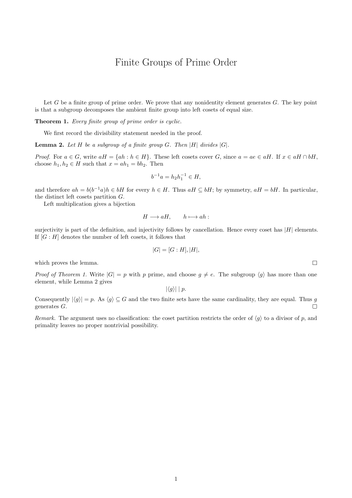
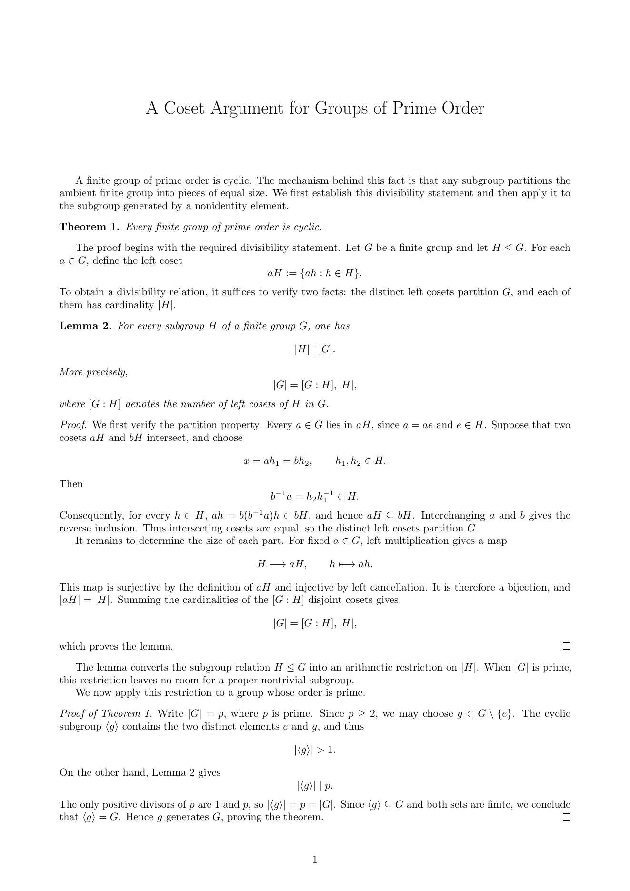

<p align="center">
  <strong>简体中文</strong> · <a href="./README_EN.md">English</a>
</p>

# Writing Like Masters

从一位学者的公开研究论文中提炼学术写作风格，生成一份可以直接交给 AI agent 使用的实用写作指南。

你只需要告诉 agent 作者是谁。它会先确认找对了人，再收集公开的论文源文件，观察作者怎样组织文字、公式和论证，最后把结果保存成一个简单的 TXT 文件。

## 最简单的用法

在这个文件夹里对 agent 说：

```text
请为 <作者名> 整理一份写作风格。先确认作者身份，然后按照 AGENTS.md 完成整个流程。
```

如果论文已经下载过，可以说：

```text
请直接使用 corpora/<作者代号>/，不要重新下载，生成最终 style。
```

agent 会按顺序做四件事：

1. 确认作者，并寻找公开论文源文件。
2. 论文准备好后，让你选择“简洁版”或“标准版”风格提炼。
3. 按所选版本总结作者的写作选择；简洁版不分析时间演化。
4. 把最终结果保存到 `styles/<作者代号>.txt`。

如果公开源文件太少，agent 会先问你是否允许使用 PDF，不会自行决定。

## 文件放在哪里

- `styles/`：最终成果，可以上传 Git。
- `corpora/`：下载的论文，只留在本机，不上传 Git。
- `scripts/`：帮 agent 下载、检查和整理材料的小工具。
- `SCHOLAR_TEX_ACQUISITION_SKILL.md`：如何找到并整理论文。
- `SCHOLAR_STYLE_DISTILLATION_LITE_SKILL.md`：简洁、非时间维度的风格整理流程。
- `SCHOLAR_STYLE_DISTILLATION_SKILL.md`：包含完整证据和时间维度的标准流程。
- `AGENTS.md`：告诉 agent 先做什么、后做什么。

下载记录、临时文件和中间分析也只留在本机，已经由 `.gitignore` 排除。

## 已有风格

这些风格都以数学正确性为先，主要区别在于如何组织问题、解释概念和推进论证：

- [Grigori Perelman](styles/grigori-perelman.txt)：直接进入核心对象，按逻辑依赖用短段落推进，并明确标出假设、缺口和尚未完成的目标。
- [Noga Alon](styles/noga-alon.txt)：问题先行、陈述精确、证明紧凑；少作铺陈，把篇幅集中在定义、关键区别和推理本身。
- [Peter Scholze](styles/peter-scholze.txt)：由明确的数学需要引出新工具，在定义、定理、解释和证明化简之间建立清楚的衔接。
- [Saharon Shelah](styles/saharon-shelah.txt)：信息密度高，强调显式的依赖关系、带类型的局部记号和可单独引用的分条定义或结论。
- [Sourav Chatterjee](styles/sourav-chatterjee.txt)：善用简单例子和直观计算引出抽象方法，同时为技术结果补充通俗解释、适用边界和局限。
- [Terence Tao](styles/terence-tao.txt)：精确交代参数范围和例外，在形式陈述与直观含义之间切换，并把长证明组织成有动机的逐步化简。
- [Yuwen Li](styles/liyuwen.txt)：从具体方程、离散对象或算法出发，重视条件、误差估计、方法性质以及与已有结果的精确比较。(只是我老板，不是大师，乐)

## 同一原稿的风格示例

下面两份文稿使用同一份数学原稿生成，分别展示 Peter Scholze 和 Terence Tao 风格下的组织方式。

### Peter Scholze

<p align="center">
  
</p>

### Terence Tao

<p align="center">
  
</p>

## 准备环境

需要 Python 3.10 或更新版本。安装依赖：

```powershell
python -m pip install -r requirements.txt
```

通常只处理论文源文件即可。只有在不得不读取 PDF 时，才可能需要额外的 PDF 文字识别工具。

## 使用提醒

- 只使用公开来源，并先确认作者身份。
- 最终 TXT 是写作参考，不是数学正确性的保证。
- 本项目是独立整理，与风格所涉及的学者本人无隶属、合作或背书关系。
- 不要上传下载的论文、网页缓存或中间文件。
- 发布前检查最终 TXT，避免保留大段原文、私人信息或第三方模板内容。

## 许可证

本仓库中的代码、工作流说明和风格文件采用 [MIT License](LICENSE) 发布。下载的论文、语料库、网页缓存及其他第三方材料不属于本仓库，也不在此许可证的授权范围内。

想了解规则，可以阅读[论文收集说明](SCHOLAR_TEX_ACQUISITION_SKILL.md)、[简洁版风格整理说明](SCHOLAR_STYLE_DISTILLATION_LITE_SKILL.md)和[标准版风格整理说明](SCHOLAR_STYLE_DISTILLATION_SKILL.md)。
